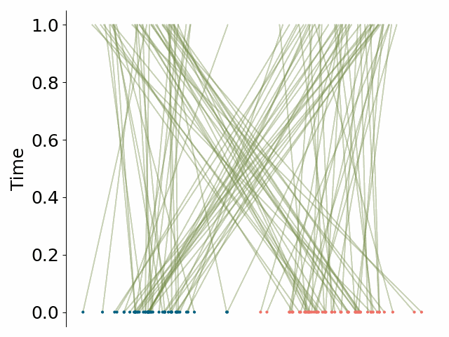
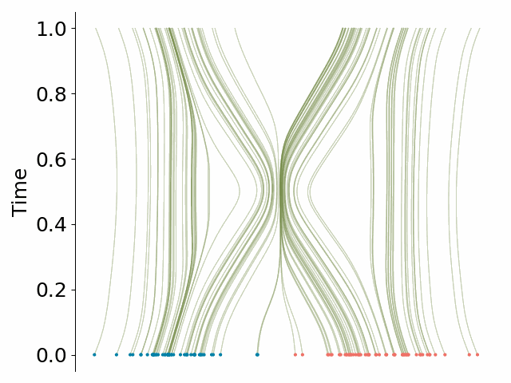
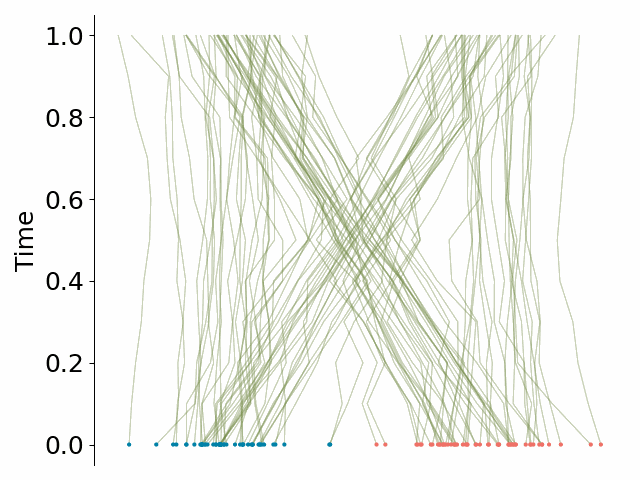

<div align="center">

# Towards Hierarchical Rectified Flow

[[OpenReview]](https://openreview.net/forum?id=6F6qwdycgJ)
[[Project]](https://riccizz.github.io/HRF/)
[[arxiv]](https://arxiv.org/abs/2502.17436)

</div>

## Description

We formulate a hierarchical rectified flow (HRF) to model data distributions. It hierarchically couples multiple ordinary differential equations (ODEs) and defines a time-differentiable stochastic process that generates a data distribution from a known source distribution. Each ODE resembles the ODE that is solved in a classic rectified flow, but differs in its domain, i.e., location, velocity, acceleration, etc. 

Unlike the classic rectified flow formulation, which formulates a single ODE in the location domain and only captures the expected velocity field (sufficient to capture a multi-modal data distribution), the hierarchical rectified flow formulation models the multi-modal random velocity field, acceleration field, etc., in their entirety. This more faithful modeling of the random velocity field enables integration paths to intersect when the underlying ODE is solved during data generation. Intersecting paths in turn lead to integration trajectories that are more straight than those obtained in the classic rectified flow formulation, where integration paths cannot intersect. 

This leads to modeling of data distributions with fewer neural function evaluations. We empirically verify this on synthetic 1D and 2D data as well as MNIST, CIFAR-10, and ImageNet-32 data. 

<table align="center">
  <tr>
    <td align="center"></td>
    <td align="center"></td>
    <td align="center"></td>
  </tr>
  <tr>
    <td align="center">Linear Interpolation</td>
    <td align="center">Rectified Flow</td>
    <td align="center">Hierarchical Rectified Flow (ours)</td>
  </tr>
</table>


## How to run

```bash
# clone project
git clone https://github.com/riccizz/HRF.git
cd HRF

# build environment
conda create -n hrf python=3.10
conda activate hrf
pip install -r requirements.txt

```

## How to cite

If you find this code useful in your research, please cite the following papers:

```bibtex
@inproceedings{
    zhang2025towards,
    title={Towards Hierarchical Rectified Flow},
    author={Yichi Zhang and Yici Yan and Alex Schwing and Zhizhen Zhao},
    booktitle={The Thirteenth International Conference on Learning Representations},
    year={2025},
    url={https://openreview.net/forum?id=6F6qwdycgJ}
}
```


## References

This repo is developed based on  [torchcfm code](https://github.com/atong01/conditional-flow-matching/). Please also consider citing them if you use this repo. 

```bibtex
@article{tong2024improving,
    title={Improving and generalizing flow-based generative models with minibatch optimal transport},
    author={Alexander Tong and Kilian FATRAS and Nikolay Malkin and Guillaume Huguet and Yanlei Zhang and Jarrid Rector-Brooks and Guy Wolf and Yoshua Bengio},
    journal={Transactions on Machine Learning Research},
    issn={2835-8856},
    year={2024},
    url={https://openreview.net/forum?id=CD9Snc73AW},
    note={Expert Certification}
}

@article{tong2023simulation,
    title={Simulation-Free Schr{\"o}dinger Bridges via Score and Flow Matching},
    author={Tong, Alexander and Malkin, Nikolay and Fatras, Kilian and Atanackovic, Lazar and Zhang, Yanlei and Huguet, Guillaume and Wolf, Guy and Bengio, Yoshua},
    year={2023},
    journal={arXiv preprint 2307.03672}
}
```